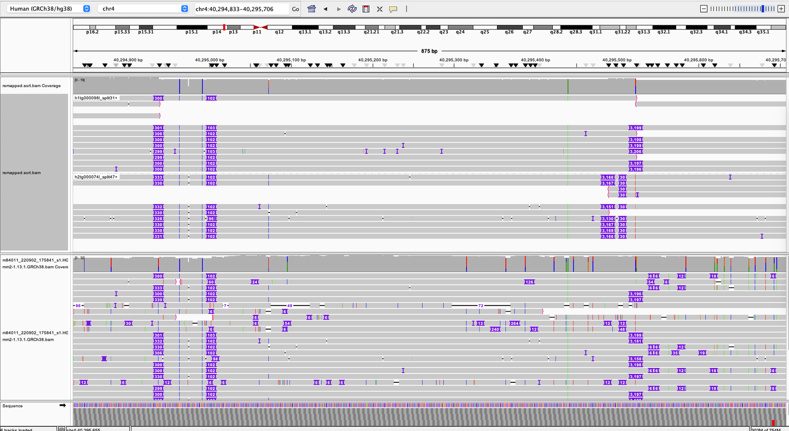

<h1 align="center"></h1>

<h1 align="center">Portello</h1>

<h4 align="center">Method to transfer HiFi read mappings from de novo assembly to reference</h4>

De novo assembly of HiFi long reads is a powerful approach to human rare-disease analysis, especially given rare
variants that may be highly diverged from reference assemblies. However, integrating global assembly into a practical
rare-disease analysis workflow faces challenges relative to traditional read mapping approaches. These include:
- small variant accuracy
- somatic variation
- methylation
- assessment of assembly error/compression
- annotation

Portello provides a simple means to reduce these challenges, by transferring HiFi read mappings from their own assembly
contigs back onto an annotated reference assembly.

Shown below is an example IGV view of portello-transferred mappings (top) from hifiasm assembly contigs vs. standard
pbmm2 mappings (bottom) from the same set of HiFi reads:

  

The IGV view spans GRCh38 region `chr4:40,294,833-40,295,706`, the portello
reads are grouped by their associated assembly contig, to create a phased-like view of the reads.

## Getting started

See the [user guide](docs/user_guide.md) for details on getting started with portello.

## DISCLAIMER

THIS WEBSITE AND CONTENT AND ALL SITE-RELATED SERVICES, INCLUDING ANY DATA, ARE PROVIDED "AS IS," WITH ALL FAULTS, WITH NO REPRESENTATIONS OR WARRANTIES OF ANY KIND, EITHER EXPRESS OR IMPLIED, INCLUDING, BUT NOT LIMITED TO, ANY WARRANTIES OF MERCHANTABILITY, SATISFACTORY QUALITY, NON-INFRINGEMENT OR FITNESS FOR A PARTICULAR PURPOSE. YOU ASSUME TOTAL RESPONSIBILITY AND RISK FOR YOUR USE OF THIS SITE, ALL SITE-RELATED SERVICES, AND ANY THIRD PARTY WEBSITES OR APPLICATIONS. NO ORAL OR WRITTEN INFORMATION OR ADVICE SHALL CREATE A WARRANTY OF ANY KIND. ANY REFERENCES TO SPECIFIC PRODUCTS OR SERVICES ON THE WEBSITES DO NOT CONSTITUTE OR IMPLY A RECOMMENDATION OR ENDORSEMENT BY PACIFIC BIOSCIENCES.
